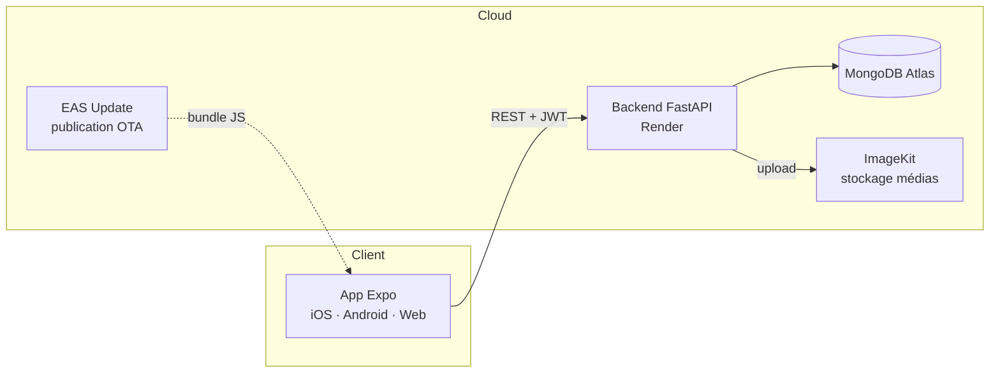

<div align="center">

# 📸 Dropa

**Le réseau social où tout se révèle le dimanche.**

Chaque Drop reste flouté jusqu'à la révélation collective hebdomadaire — un rendez-vous, pas un fil sans fin.

[](backend)
[](frontend)
[](https://www.mongodb.com/atlas)
[](frontend)
[](backend/test_server.py)
[](LICENSE)

</div>

---

## Sommaire

- [Concept](#concept)
- [Fonctionnalités](#fonctionnalités)
- [Architecture](#architecture)
- [Stack technique](#stack-technique)
- [Démarrage local](#démarrage-local)
- [Variables d'environnement](#variables-denvironnement)
- [Tests](#tests)
- [Déploiement](#déploiement)
- [Sécurité](#sécurité)
- [Structure du projet](#structure-du-projet)
- [Licence](#licence)

---

## Concept

Dropa inverse la logique du fil d'actualité instantané. Un **Drop** (photo ou vidéo) posté un jour donné reste flouté et invisible — y compris pour ses propres amis — jusqu'à la **révélation collective du dimanche à 20h00 UTC**. Ce n'est qu'à ce moment que les Drops de la semaine s'affichent d'un coup, pour tout le monde en même temps.

## Fonctionnalités

| Domaine | Détail |
|---|---|
| **Comptes** | Inscription / connexion par JWT, profil (pseudo, bio, photo) |
| **Social** | Recherche d'utilisateurs, demandes d'amis, liste d'amis |
| **Drops** | Création photo/vidéo, floutage garanti côté serveur jusqu'à la révélation |
| **Interactions** | Likes et commentaires (activés uniquement après révélation) |
| **Messagerie** | Conversations privées entre amis |
| **Notifications** | In-app et push (Expo Notifications) |
| **Suivi** | Calendrier personnel, résumé hebdomadaire, classement entre amis |
| **Streak** | Streak quotidien, Streak Freezes, récompenses aux paliers (3, 7, 14, 30, 60, 100 jours) |
| **Personnalisation** | Thème clair / sombre / système |

## Architecture



Le backend est une API REST unique (`server.py`) qui sert de source de vérité pour la logique de révélation : le floutage n'est **jamais** un simple effet visuel côté client — le média n'est tout simplement pas renvoyé par l'API tant que la révélation n'a pas eu lieu.

## Stack technique

| Composant | Techno |
|---|---|
| Frontend | React Native, Expo (SDK 54), TypeScript, Expo Router |
| State management | Zustand |
| Backend | FastAPI (Python) |
| Base de données | MongoDB |
| Authentification | JWT |
| Stockage médias | ImageKit (repli automatique en base64 si non configuré) |
| Notifications | Expo Notifications |
| Animations | React Native Reanimated |
| Déploiement backend | Render |
| Distribution mobile | EAS Update (Expo Go) |

## Démarrage local

### Prérequis
- Node.js ≥ 18, Python ≥ 3.11
- Une instance MongoDB (locale ou [Atlas](https://www.mongodb.com/atlas), tier gratuit suffisant)

### Backend

```bash
cd backend
python -m venv venv
./venv/Scripts/activate        # Windows
# source venv/bin/activate     # macOS/Linux
pip install -r requirements.txt
```

Créer `backend/.env` (voir [Variables d'environnement](#variables-denvironnement)), puis :

```bash
uvicorn server:app --reload --host 0.0.0.0 --port 8000
```

### Frontend

```bash
cd frontend
npm install
```

Créer `frontend/.env.local` :

```
EXPO_PUBLIC_BACKEND_URL=http://<ip-ou-domaine-du-backend>:8000
```

```bash
npm run web        # navigateur
npx expo start      # QR code pour Expo Go (iOS/Android)
```

## Variables d'environnement

### `backend/.env`

| Variable | Requis | Description |
|---|---|---|
| `MONGO_URL` | ✅ | Chaîne de connexion MongoDB |
| `DB_NAME` | ✅ | Nom de la base (ex. `dropa_db`) |
| `JWT_SECRET` | ✅ | Secret de signature des tokens — long et aléatoire en production |
| `IMAGEKIT_PRIVATE_KEY` | — | Clé privée ImageKit |
| `IMAGEKIT_PUBLIC_KEY` | — | Clé publique ImageKit |
| `IMAGEKIT_URL_ENDPOINT` | — | Endpoint ImageKit (ex. `https://ik.imagekit.io/<id>`) |

Sans les clés ImageKit, les photos sont stockées en base64 dans MongoDB et les vidéos sur le disque local du serveur (non recommandé en production — voir [Sécurité](#sécurité)).

### `frontend/.env.local`

| Variable | Requis | Description |
|---|---|---|
| `EXPO_PUBLIC_BACKEND_URL` | ✅ | URL de base de l'API backend |

## Tests

```bash
cd backend
pip install -r requirements-dev.txt
pytest test_server.py -v
```

61 tests couvrant l'authentification, les amis, les Drops, la logique de révélation (y compris les cas limites de fuseau horaire et de changement d'heure), le streak, la messagerie et la sécurité (contrôle d'accès, validation des entrées). La suite tourne contre une base MongoDB en mémoire (`mongomock`), sans dépendance à une instance réelle.

`run_mock_server.py` lance le vrai serveur FastAPI contre cette base en mémoire, pour des tests manuels sans MongoDB.

## Déploiement

| Composant | Où | Notes |
|---|---|---|
| Backend | [Render](https://render.com) (`render.yaml`, Blueprint) | Variables à renseigner dans le dashboard : `MONGO_URL` + clés ImageKit |
| Base de données | [MongoDB Atlas](https://www.mongodb.com/atlas) | Whitelister `0.0.0.0/0` dans Network Access pour autoriser Render |
| Mobile | [EAS Update](https://docs.expo.dev/eas-update/introduction/) | Publication OTA consultable en permanence depuis Expo Go, indépendante d'un serveur local |

Publier une mise à jour mobile après un changement de code :

```bash
cd frontend
npx eas-cli update --branch production --message "..."
```

## Sécurité

Un audit de sécurité et de stabilité complet a été réalisé — contrôle d'accès, validation des entrées, gestion des secrets, performances. Voir [`AUDIT_DROPA.md`](AUDIT_DROPA.md) pour le rapport détaillé, les corrections apportées et la checklist avant mise en production.

Points clés :
- Le floutage est appliqué **côté serveur** (le média n'est jamais transmis avant révélation), pas seulement visuel.
- Mots de passe hachés (bcrypt), sessions par JWT signé.
- Aucun secret n'est commité dans le dépôt.

## Structure du projet

```
backend/
├── server.py              API FastAPI (routes, modèles, logique métier)
├── test_server.py          Suite de tests (pytest + MongoDB en mémoire)
├── run_mock_server.py       Serveur de test sans MongoDB réel
└── requirements.txt

frontend/
├── app/                    Écrans (Expo Router, routing par fichiers)
├── src/
│   ├── api/                 Client HTTP (axios)
│   ├── store/                État global (Zustand)
│   ├── components/            Composants partagés
│   ├── hooks/                 Hooks (thème, notifications push)
│   └── utils/                  Utilitaires (résolution média, alertes cross-plateforme)
└── app.json                 Config Expo / EAS

render.yaml                 Déploiement backend (Render Blueprint)
AUDIT_DROPA.md              Rapport d'audit complet
```

## Licence

Tous droits réservés. Ce dépôt est privé et propriétaire — voir [`LICENSE`](LICENSE). Aucune copie, modification, redistribution ou utilisation n'est autorisée sans permission écrite préalable.
